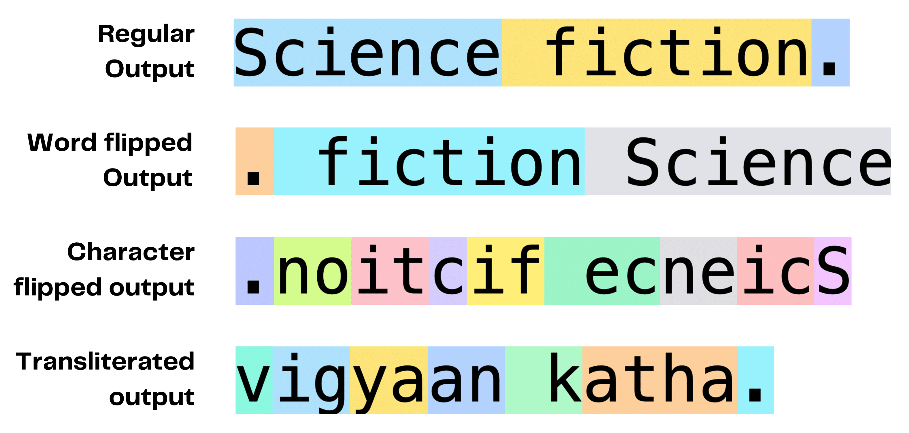

# Learn-Unlearn-Relearn-Noise-SLMs

### Abstract

Small Language Models (SLMs) are generally considered more compact versions of large language models (LLMs). This study investigates the ability of SLMs with parameters between 1 and 3 billion to learn, retain, and subsequently eliminate different types of noise present in the data. Four pre-trained SLMs were utilized for this: Olmo 1B, Qwen1.5 1.8B, Gemma 2B, and Phi2 2.7B. The models were instruction-tuned on noise-free data and tested using in-context examples to determine if they could learn noise through examples. Subsequently, noise patterns were introduced in instruction tuning to evaluate the noise learning, unlearning, and retention capabilities of the models. Olmo, the smallest model, was highly sensitive to noise, quickly adapting to noisy patterns. Phi2 resisted learning character-level and transliteration noise, likely due to its carefully curated, structured, and high-quality pretraining data. Gemma excelled with transliteration noise, likely benefiting from its multilingual pretraining. The findings can be used to develop robust training strategies for SLMs.

### Directory Structure

```plaintext

Learn-Unlearn-Relearn-Noise-SLMs/
├── assets/
│   ├── tokenizer.png                    # BPE tokenization of 'Science fiction' under different noises
├── counterfactuals/                     
│   ├── creating_counterfactuals.py      # script to create counterfactual examples
│   ├── identify_counterfactuals.py      # script to identify counterfactual samples
├── data/                                
│   ├── 50samples_train/                 # training data with 50 sample cases
│   ├── test/                            # testing dataset
│   └── train/                           # training dataset
├── gemma/                               # source, config, train, inference, and evaluation for Gemma
│   ├── configs/                         # configuration files for Gemma
│   ├── evaluation/                      # evaluation scripts for Gemma
│   ├── src/                             # source code specific to Gemma
│   ├── inference.py                     # inference script for Gemma model
│   └── train.py                         # training script for Gemma model
├── in_context/                          # in-context learning with LLMs and SLMs
│   ├── create_incontext_examples.py     # script to create in-context learning examples
│   ├── test_huggingface.py              # script to test LLMs using Hugging Face
│   └── test_together.py                 # script to test LLMs using Together API
├── olmo/                                # source, config, train, inference, and evaluation for Olmo
├── phi/                                 # source, config, train, inference, and evaluation for Phi
├── qwen/                                # source, config, train, inference, and evaluation for Qwen
├── transliteration/                                  
│   └── transliteration.py               # script for transliteration data generation
├── LICENSE                              # license file for the repository
└── README.md                            # README file with project overview and instructions

```

### Tokenization under different noise conditions



### Citation

If you find our datasets and work beneficial, please cite our work:

```bibtex
@article{scaria2024can,
  title={Can Small Language Models Learn, Unlearn, and Retain Noise Patterns?},
  author={Scaria, Nicy and Kennedy, Silvester John Joseph and Subramani, Deepak},
  journal={arXiv preprint arXiv:2407.00996},
  year={2024}
}
```
